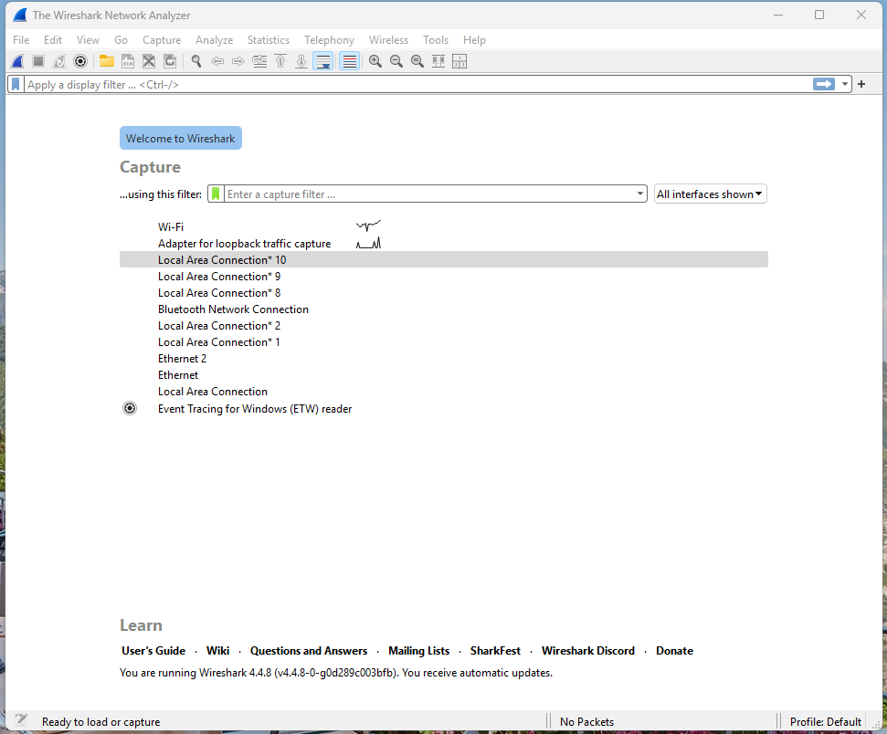
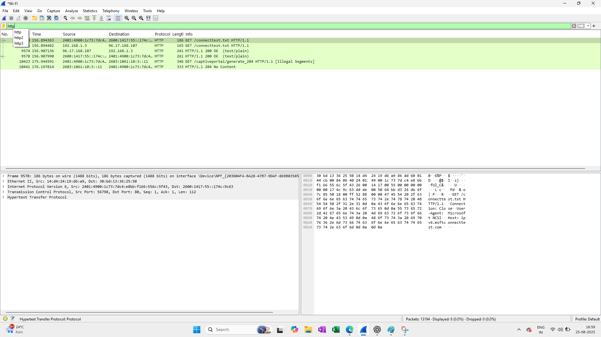
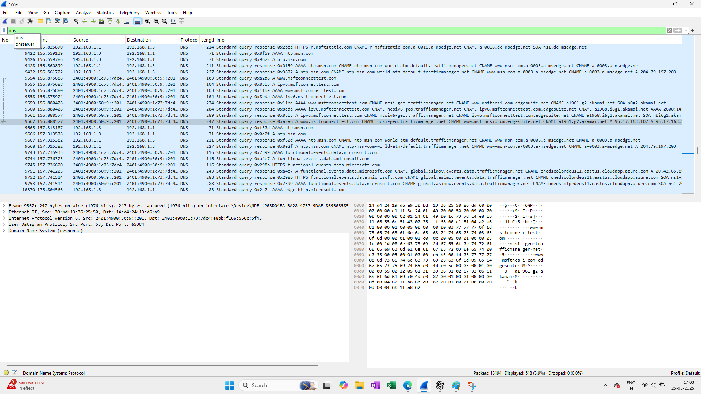
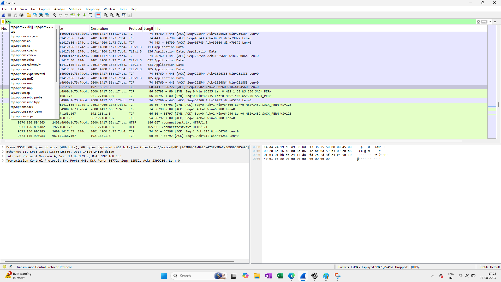

# 🕵️ Network Packet Analysis with Wireshark

 Wireshark, a powerful open-source packet analyzer, allows for the granular inspection of network traffic, enabling 
professionals to understand the flow of data, pinpoint anomalies, and enhance the overall integrity and efficiency of the network. This repository demonstrates **network traffic analysis** using **Wireshark**.  

It includes sample `.pcap` files, applied filters, detailed analysis, and documented findings to help understand communication patterns, detect anomalies, and troubleshoot network issues.

---

## 🎯 Objectives

- Understand communication patterns by capturing and examining packets exchanged between devices. 
- Enhance security by identifying suspicious activities, anomalies, and potential threats in traffic. 
- Troubleshoot network issues through detailed inspection of protocols, flows, and packet timing. 
- Improve performance by analyzing packet data (source/destination, protocol usage, transfer timing). 

---

## 🛠️ Tools & Requirements

| Tool/Software | Purpose |
|---------------|---------|
| **Wireshark** | Capture and analyze network packets |
| **PCAP Files** | Sample traffic datasets for analysis |
| **Operating System** | Works on Windows, Linux, macOS |
| **Optional: Tshark** | Command-line Wireshark for advanced/automated analysis |

---

## 📂 Dataset / Capture Files

| File Name | Description |
|-----------|-------------|
| `http_traffic.pcap` | Contains sample HTTP requests and responses (GET, POST, and server replies). |
| `dns_lookup.pcap` | Demonstrates DNS query and response packets for resolving domain names. |
| `tcp_handshake.pcap` | Shows the TCP 3-way handshake and connection establishment process. |
| `mixed_traffic.pcap` | A combined capture including HTTP, DNS, and TCP traffic for practice. |

🔹 **Note**: All captures are **sample data only** for educational purposes. No private or sensitive data is included.

---

## ⚙️ How to Run the Analysis

| Step | Description | Command/Action |
|------|-------------|----------------|
| **1. Install Wireshark** | Download Wireshark from [official website](https://www.wireshark.org/download.html) and install it. | |
| **2. Open Capture File** | Launch Wireshark → File → Open → Select `.pcap` file from `/captures`. | |
| **3. Apply Filters** | Use Wireshark display filters to focus on traffic of interest. | Examples:<br>- HTTP → `http`<br>- DNS → `dns`<br>- TCP Handshake → `tcp.flags.syn==1 && tcp.flags.ack==0`<br>- IP specific → `ip.addr == 192.168.1.10` |
| **4. Analyze Packets** | Select and expand packets to view details (Ethernet, IP, TCP/UDP, Application). | |
| **5. Use Statistics** | Wireshark → Statistics → Protocol Hierarchy / Conversations to explore traffic breakdown. | |
| **6. Document Findings** | Note anomalies, suspicious traffic, or normal behaviors. Add screenshots for clarity. | |
| **7. Optional (CLI)** | Run Tshark for command-line analysis. | ```bash<br>tshark -r captures/http_traffic.pcap -Y "http"<br>``` |

---

## 🔍 Example Filters

| Filter | Purpose |
|--------|---------|
| `http` | Show only HTTP traffic |
| `dns` | Show DNS queries and responses |
| `tcp.flags.syn==1 && tcp.flags.ack==0` | Show TCP SYN packets (start of handshake) |
| `ip.addr == 192.168.1.10` | Show packets to/from a specific IP |
| `tcp.port == 80` | Show traffic on TCP port 80 (HTTP) |
| `udp.port == 53` | Show DNS traffic on UDP port 53 |

---

## 📊 Analysis & Findings

| Capture File | Key Observations |
|--------------|------------------|
| `http_traffic.pcap` | Identified GET/POST requests, HTTP status codes, and server responses. |
| `dns_lookup.pcap` | Observed DNS query/response for domain resolution (e.g., `example.com`). |
| `tcp_handshake.pcap` | Confirmed proper 3-way TCP handshake (SYN → SYN-ACK → ACK). |
| `mixed_traffic.pcap` | Combined analysis of HTTP, DNS, and TCP flows for correlation. |

---


## 📸 Screenshots

### Wireshark 


### HTTP Traffic


### DNS Query


### TCP Handshake


---

## ⚡ Future Work

| Planned Feature | Description |
|-----------------|-------------|
| Automation | Automate capture and filtering using Python (Scapy, PyShark). |
| Security Focus | Extend analysis for intrusion detection and anomaly detection. |
| Visualization | Generate protocol usage charts and timeline graphs. |

---


## 📖 References

- [Wireshark Official Documentation](https://www.wireshark.org/docs/)  
- TCP/IP Illustrated – W. Richard Stevens  

